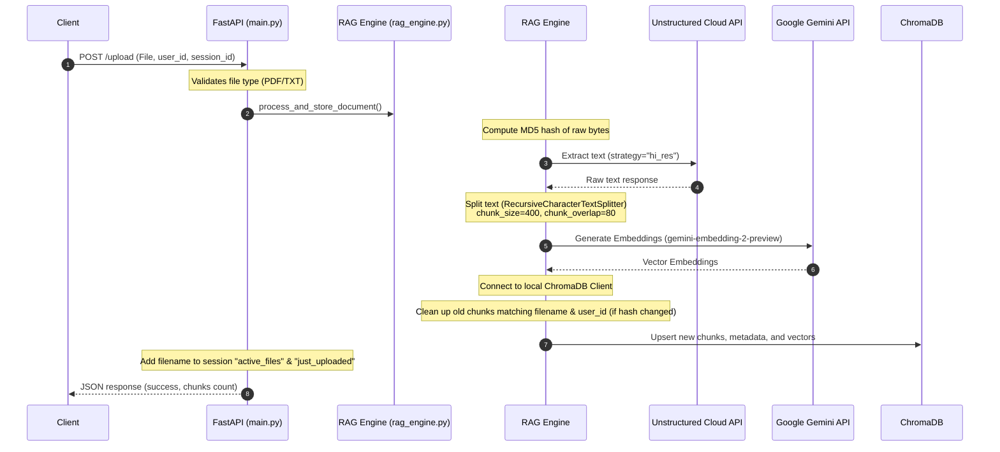
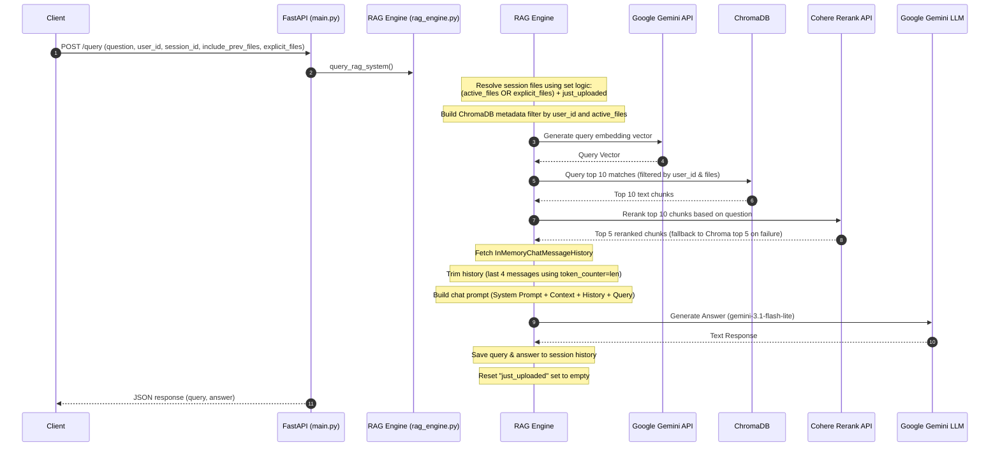

# Project Walkthrough: Document Assistant RAG System

This document provides a detailed overview of the Document Assistant RAG (Retrieval-Augmented Generation) system. It is designed to help an AI or system architect analyze the existing codebase and propose structural, architectural, database, and frontend enhancements to make it a production-ready application.

---

## 1. System Overview & Technology Stack

The project is a backend-only prototype for a multi-tenant document query assistant. Users can upload text or PDF documents, which are parsed, split, embedded, and stored in a vector database. Users can then ask questions within the context of their uploaded documents, with chat memory maintained across turns.

### Core Technology Stack

| Component | Technology | Description |
| :--- | :--- | :--- |
| **API Framework** | [FastAPI](https://fastapi.tiangolo.com/) + [Uvicorn](https://www.uvicorn.org/) | Modern, high-performance web framework for building APIs in Python. |
| **Orchestration** | [LangChain](https://www.langchain.com/) | Orchestrates the prompt templates, message history, message trimming, and document loaders. |
| **Document Parsing** | [Unstructured API](https://unstructured.io/) | Used via `UnstructuredLoader` with `partition_via_api=True` to parse PDFs and TXT files using Unstructured's cloud APIs. |
| **Vector Database** | [ChromaDB](https://www.trychroma.com/) | Stored locally using `chromadb.PersistentClient` in `./chroma_db`. |
| **Embeddings** | Google Generative AI | `models/gemini-embedding-2-preview` (with fallback to `models/text-embedding-004`). |
| **Reranker** | Cohere Rerank API | `CohereRerank` with model `rerank-english-v3.0` to filter retrieved chunks down to the top 5. |
| **LLM (Generator)**| Google Gemini | `gemini-3.1-flash-lite` (via `ChatGoogleGenerativeAI`). |

---

## 2. System Architecture & Workflows

Below are the detailed workflows for the two primary operations: **Document Ingestion** and **Retrieval-Augmented Querying**.

### A. Document Ingestion Workflow

When a file is uploaded, the system parses it and indexes it in ChromaDB:



### B. Retrieval-Augmented Query Workflow

When a user submits a query, the system retrieves relevant document context and feeds it to Gemini:



---

## 3. Detailed Code Analysis

The project contains three core Python files:

### 1. [main.py](file:///e:/document-assistant/main.py)
This is the FastAPI web server. It handles routes, validation, and CORS configurations.
*   **CORS Configuration:** Configured to allow all origins (`*`) for easy local development.
*   **Endpoints:**
    *   `GET /`: Basic health check returning API status.
    *   `GET /users/{user_id}/sessions`: Lists active sessions for a specific user ID. If the user doesn't exist, initializes them with an empty session dictionary.
    *   `POST /users/{user_id}/sessions/new`: Clears and force-initializes a fresh session canvas for a specific user and session ID.
    *   `POST /upload`: Uploads a file via multipart form-data. Validates file extension and Content-Type, reads the file bytes, calls `rag_engine.process_and_store_document`, and appends the file to the session's file list.
    *   `POST /query`: Processes queries against the indexed documents. Supports specifying search scopes via `include_prev_files` (boolean) and `explicit_files` (explicit list of filenames).
    *   `DELETE /users/{user_id}/sessions/{session_id}/files/{filename}`: Undoes a file upload, removing its chunks from ChromaDB and the session, but *only* if the upload has not been committed (i.e. is still in the `just_uploaded` set and has not had a query run against it yet).

### 2. [rag_engine.py](file:///e:/document-assistant/rag_engine.py)
This file encapsulates the business logic for document ingestion, storage, retrieval, memory management, and generative prompting.
*   **State Management:** An in-memory dictionary `session_store` holds session data in the format:
    ```python
    session_store[user_id][session_id] = {
        "history": InMemoryChatMessageHistory(),
        "active_files": [], # List of files currently in scope
        "just_uploaded": set() # Files uploaded in this session that haven't been queried yet
    }
    ```
*   **Document Ingestion:**
    1.  Calculates MD5 hash of raw bytes.
    2.  Parses text using the `UnstructuredLoader`.
    3.  Splits text using `RecursiveCharacterTextSplitter` with `chunk_size=400` and `chunk_overlap=80`.
    4.  Embeds chunks using Google embeddings.
    5.  Deletes outdated database records (same filename, same user, but different MD5 hash) to keep the DB clean when a document is updated.
    6.  Upserts chunks into ChromaDB with ID format `{file_hash}_{chunk_index}` and metadata linking to `user_id`, `filename`, and `file_hash`.
*   **Query Resolution:**
    1.  Determines file scope using set logic.
    2.  Filters vectors in ChromaDB on `user_id` and the scoped files.
    3.  Reranks retrieved documents with Cohere Rerank API (top 5).
    4.  Applies memory trimming to the in-memory chat history:
        ```python
        trimmed_messages = trim_messages(
            history.messages, max_tokens=4, strategy="last", token_counter=len
        )
        ```
    5.  Invokes `gemini-3.1-flash-lite` using a strict system instruction to prevent hallucinations ("Answer the user's question using ONLY the provided context...").
    6.  Appends the exchange to chat history and resets `just_uploaded`.

### 3. [rag_test.py](file:///e:/document-assistant/rag_test.py)
A command-line script used to test the ingestion, vector search, and generation pipelines locally without starting the FastAPI web server.
*   Uses a larger chunk configuration: `chunk_size=1000` and `chunk_overlap=100`.
*   Operates on a local PDF file path (e.g. `sample.pdf`) rather than memory bytes.
*   Retrieves the top 5 chunks directly from ChromaDB without re-ranking before calling Gemini.

---

## 4. Database Schema & Vector Indexes

The vector store uses ChromaDB, persisting files in a local directory (`./chroma_db`) under the collection name `document_chunks`.

### Document Chunk Structure

Each record in the collection contains:
*   **ID:** `{file_hash}_{chunk_id}` (e.g., `d41d8cd98f00b204e9800998ecf8427e_0`)
*   **Vector Embedding:** Array of floating-point numbers representing the query/chunk text semantic representation.
*   **Document Text:** The actual textual string segment extracted from the document.
*   **Metadata Fields:**
    *   `user_id`: Standard string linking the chunk to a specific tenant/user.
    *   `filename`: The original name of the source document (used for file-scoping during vector queries).
    *   `source`: Path or name representing the document source.
    *   `file_hash`: MD5 hash of the source document file bytes.
    *   `chunk_id`: Integer index representing the sequence order of the chunk in the document.

---

## 5. Production Limitations & Architecting for Scale

The current codebase is a local prototype and contains several limitations that must be addressed to turn it into a production-grade system.

### A. Architectural Bottlenecks

1.  **In-Memory Session Store (`session_store`)**
    *   *Problem:* Chat history, active file lists, and upload flags are stored in a local Python dictionary. If the API server crashes, restarts, or scales horizontally behind a load balancer, all user session states are lost.
    *   *Production Fix:* Move session state, chat history, and file scopes to an external database like Redis or a SQL database (PostgreSQL/MySQL) with a database-backed chat message history adapter.
2.  **Local Directory ChromaDB Persistent Client**
    *   *Problem:* The Chroma vector store resides on the local disk (`./chroma_db`). In a containerized cloud deployment (e.g., AWS ECS, Kubernetes, GCP Cloud Run), containers are ephemeral, and scaling to multiple instances will lead to out-of-sync or missing databases.
    *   *Production Fix:* Deploy Chroma as a standalone service (Chroma Server), or switch to a cloud-managed vector database (e.g., Pinecone, Qdrant, Milvus, or pgvector in a managed PostgreSQL instance).
3.  **Synchronous, Blocking File Ingestion**
    *   *Problem:* The file upload endpoint performs file reading, Unstructured cloud parser calls, embedding calls, and database updates *synchronously* inside the FastAPI request thread. For large documents, this request will block, potentially causing timeouts or choking server threads.
    *   *Production Fix:* Offload document ingestion to an asynchronous task queue (e.g., Celery, Dramatiq, or FastAPI background tasks backed by Redis/RabbitMQ). The `/upload` endpoint should save the file, enqueue the task, and return a task ID immediately, allowing the client to poll for ingestion completion.
4.  **Security and Tenancy Concerns**
    *   *Problem:* There is no authentication or authorization mechanism. The client can supply any `user_id` in the API requests to access or modify data.
    *   *Production Fix:* Implement JWT-based auth (OAuth2) to validate users, and enforce strict database query scoping based on the authenticated user's claim rather than trusting client-sent HTTP variables.

### B. Logic and Code Quality Issues

1.  **Confusing Token Counter Config**
    *   *Problem:* The RAG engine limits chat history length using LangChain's `trim_messages` with:
        ```python
        trimmed_messages = trim_messages(
            history.messages, max_tokens=4, strategy="last", token_counter=len
        )
        ```
        In LangChain, if the `token_counter` parameter is a standard python function like `len`, it will be passed the list of messages and return its count. This limits history to the last 4 *messages*. While this works as a simple message-count-based truncation, it is deceptively named `max_tokens=4` (which looks like 4 tokens instead of 4 messages).
    *   *Production Fix:* Replace `token_counter=len` with a true token counter function (e.g. using `tiktoken` or Gemini's model token counting API) and set `max_tokens` to an appropriate token count (e.g. `2048` or `4096`).
2.  **Inconsistent Text Splitting**
    *   *Problem:* `rag_engine.py` uses a chunk size of 400 with an overlap of 80, whereas the test CLI (`rag_test.py`) uses a chunk size of 1000 with an overlap of 100.
    *   *Production Fix:* Unify split configurations under environment variables or a shared configuration schema.
3.  **Unstructured Cloud API Dependency**
    *   *Problem:* Raw file bytes are sent to Unstructured's cloud API for text extraction. This introduces cost, network latency, and data privacy concerns.
    *   *Production Fix:* For simple PDFs and TXT files, use lightweight local parsers (e.g. `pypdf`, `pdfminer`, or `fitz`). Use Unstructured's cloud service only when complex high-fidelity layout analysis (tables, forms, images) is required, and make it configurable.

---

## 6. Frontend Requirements (To Be Built)

The application currently has no user interface. A production-ready implementation should include a responsive frontend with the following capabilities:

*   **Authentication Portal:** Sign-up, login, and token handling.
*   **Session Management Dashboard:** Sidebar to create new chat sessions, view session history, and toggle between existing sessions.
*   **Document Management Console:**
    *   Drag-and-drop file uploader (supporting PDF/TXT).
    *   List of files uploaded in the active session.
    *   Visual "Undo Upload" button (available immediately after upload, before a query is sent).
    *   Ability to scope queries (e.g. checkboxes to select which documents the assistant should reference for the current question).
*   **Chat Interface:**
    *   Interactive chat screen supporting markdown rendering, code blocks, and source citations.
    *   Streaming responses (using Server-Sent Events / SSE from the FastAPI backend to display LLM responses letter-by-letter).
    *   Loading state animations for ingestion (e.g., processing spinner) and querying (e.g., typing indicators).

---

## 7. Recommended Next Steps for Architectural Refactoring

1.  **Database Migration:** Set up PostgreSQL (for relational data like users, sessions, metadata, and chat history) and integrate a managed vector store (e.g., Qdrant or Pinecone).
2.  **Task Queue Setup:** Setup Redis and Celery to process document parses asynchronously.
3.  **Model Configuration:** Refactor embedding and generation LLM setups to use environment variables for model names, temperatures, and chunk parameters.
4.  **API Restructuring:** Group endpoints under router prefixes (`/api/v1/auth`, `/api/v1/documents`, `/api/v1/chat`) and implement standard FastAPI dependency injection for DB sessions and user authorization.
5.  **Frontend Bootstrap:** Initialize a Next.js (React) project styled with Tailwind CSS, utilizing component libraries like shadcn/ui for high-quality, premium visual elements.
